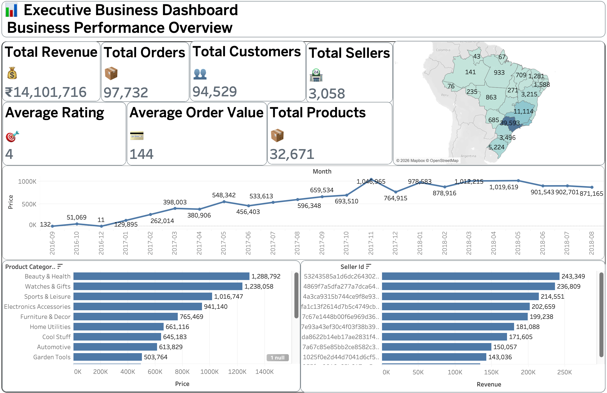
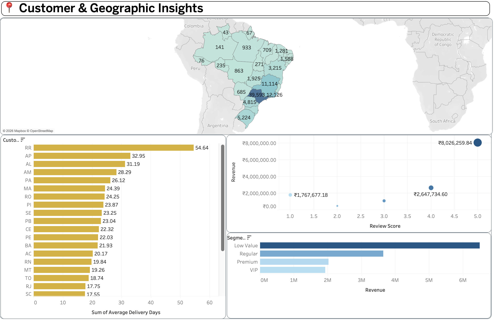
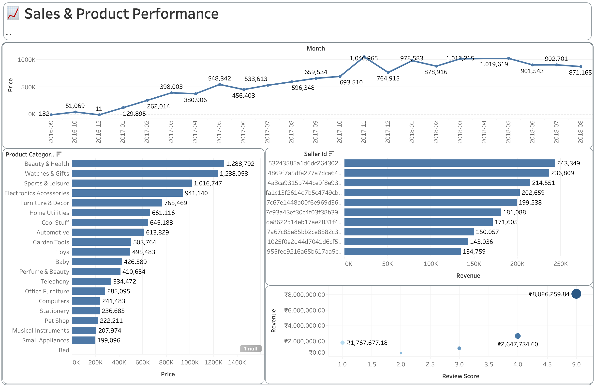

# 📊 InsightX – Customer Growth Business Intelligence Platform

> ### An end-to-end Business Intelligence & Sales Analytics platform built using **Python, SQL, and Tableau** to transform raw e-commerce data into executive-level business insights.

<p align="center">


</p>

---

# 🚀 Project Overview

InsightX is a complete Business Intelligence platform developed to analyze large-scale e-commerce data and convert it into meaningful business insights for executives and decision-makers.

The project combines **Python**, **SQL**, and **Tableau** to perform data preparation, business analysis, KPI tracking, customer analytics, geographic insights, and sales performance visualization through interactive dashboards.

The objective is to simulate a real-world Business Intelligence workflow similar to what Business Analysts and Data Analysts build inside modern organizations.

---

# 🎯 Business Objectives

- Monitor overall business performance
- Track revenue and sales growth
- Analyze customer behaviour
- Identify top-performing sellers
- Measure customer satisfaction
- Evaluate product performance
- Analyze geographical distribution
- Support executive decision-making through interactive dashboards

---

# 🛠 Tech Stack

| Technology | Purpose |
|------------|---------|
| Python | Data Cleaning & Preparation |
| SQL | Business Analysis |
| Tableau | Dashboard Development |
| CSV Dataset | Data Source |
| Git & GitHub | Version Control |

---

# 📂 Project Structure

```text
InsightX-Customer-Growth-Business-Intelligence-Platform
│
├── Dashboard
├── Dashboard_Data
├── Dataset
│ ├── raw
│ └── processed
├── Documentation
├── Images
├── Python
│ └── notebooks
├── Reports
├── SQL
├── requirements.txt
├── LICENSE
└── README.md
```

---

# ⚙️ Project Workflow

```text
Raw Dataset
      │
      ▼
Python Data Cleaning
      │
      ▼
Processed Dataset
      │
      ▼
SQL Business Analysis
      │
      ▼
Dashboard Data
      │
      ▼
Interactive Tableau Dashboards
      │
      ▼
Business Insights
```

---

# 📊 Dashboard Preview

## 📈 Dashboard 1 — Executive Business Dashboard

Executive dashboard providing a complete overview of business performance through KPIs, revenue, customers, sellers, products, trends, and category analysis.

<p align="center">

</p>

### Key Highlights

- Total Revenue
- Total Orders
- Total Customers
- Total Sellers
- Total Products
- Average Order Value
- Monthly Revenue Trend
- Product Category Performance
- Top Seller Analysis
- Geographic Distribution

---

## 📍 Dashboard 2 — Customer & Geographic Insights

This dashboard focuses on customer behaviour, geographic performance, delivery analysis, customer segmentation, and review analytics.

<p align="center">

</p>

### Key Highlights

- Customer Distribution
- State-wise Customers
- Average Delivery Time
- Customer Segmentation
- Review Score Analysis
- Geographic Insights

---

## 📉 Dashboard 3 — Sales & Product Performance

Business performance dashboard designed to evaluate revenue trends, product performance, seller contribution, and customer review impact.

<p align="center">

</p>

### Key Highlights

- Monthly Revenue Trend
- Product Category Analysis
- Top Sellers
- Review Score vs Revenue
- Sales Performance Analysis

---

# 🗄 Database Schema

The project follows a relational e-commerce database structure consisting of customers, sellers, products, orders, payments, reviews, and geolocation datasets.

<p align="center">

</p>

---

# 📈 Business Insights Generated

✔ Revenue trend analysis

✔ Customer growth analysis

✔ Product category performance

✔ Seller performance ranking

✔ Geographic customer distribution

✔ Average order value analysis

✔ Customer satisfaction analysis

✔ Delivery performance analysis

✔ Executive KPI reporting

---

# ⭐ Features

- Executive KPI Dashboard
- Interactive Tableau Dashboards
- Business Intelligence Reporting
- Customer Analytics
- Product Analytics
- Seller Performance Analysis
- Geographic Analysis
- SQL Business Queries
- Python Data Preparation
- Clean Project Structure
- Professional Documentation

---

# 📌 Skills Demonstrated

- Data Cleaning
- Exploratory Data Analysis
- SQL Analytics
- Tableau Dashboard Design
- KPI Development
- Business Intelligence
- Data Visualization
- Business Analysis
- Dashboard Storytelling
- Git & GitHub

---

# 📈 Future Improvements

- Real-time dashboard integration
- Power BI version
- Machine Learning sales forecasting
- Customer churn prediction
- RFM customer segmentation
- Automated ETL pipeline
- Cloud deployment

---

# 👨‍💻 Author

**Anubhav Rathore**

B.Tech CSE (AI) | Data Analyst | Business Intelligence Enthusiast

GitHub:
https://github.com/AnubhavRathore09

---

# ⭐ If you found this project useful, don't forget to Star the repository.
